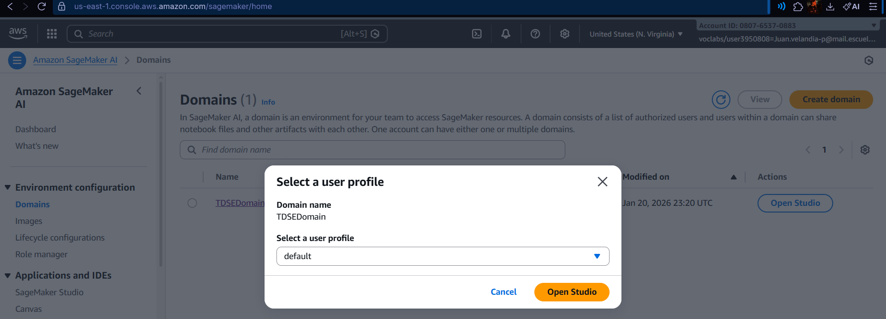
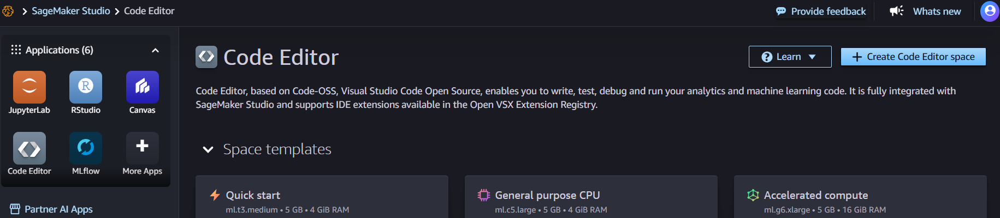
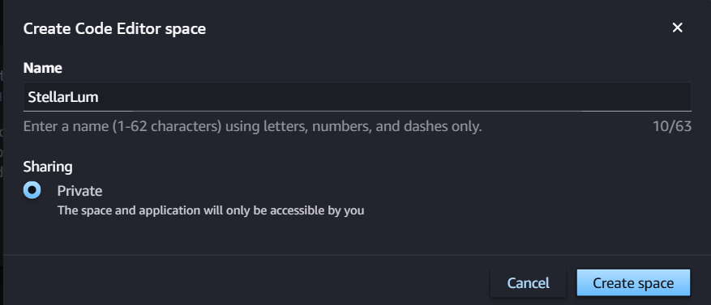
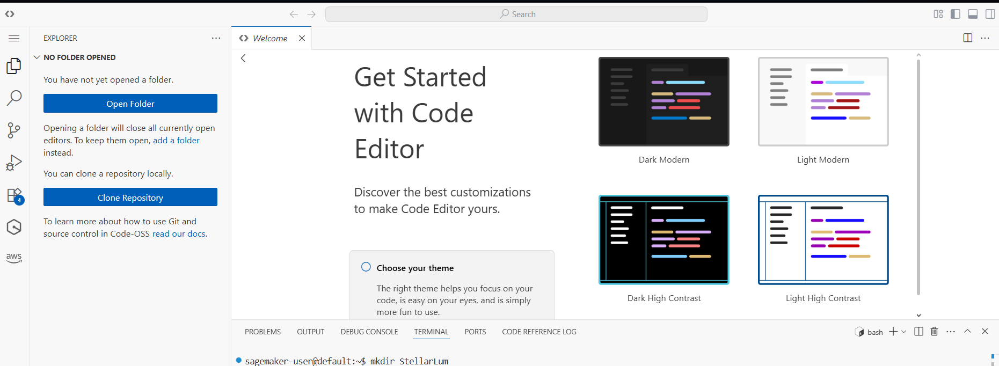
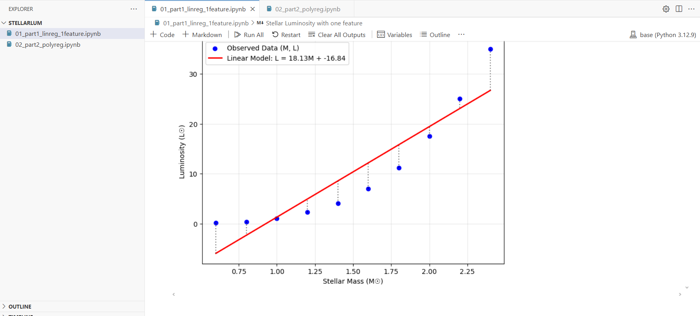
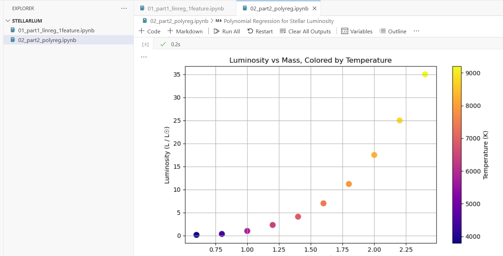

# Stellar-Luminosity
Juan Sebastian Velandia

This repository contains two Jupyter notebooks developed as part of a Machine Learning Bootcamp within the course *Digital Transformation and Enterprise Architecture*.

The goal is to implement linear and polynomial regression **from first principles**, without using any machine-learning libraries. All optimization, loss functions, and gradients are explicitly defined.

## Context

In modern enterprise architectures, machine learning is a first-class architectural capability. Understanding how models are constructed, optimized, and validated is essential for designing intelligent cloud-native systems.

This assignment models stellar luminosity using simplified astrophysical datasets inspired by main-sequence stars.

## Contents

### 01_part1_linreg_1feature.ipynb
- Linear regression with one feature (stellar mass)
- Explicit bias term
- Cost surface visualization
- Gradient descent (loop-based and vectorized)
- Learning rate experiments
- Convergence analysis

### 02_part2_polyreg.ipynb
- Polynomial regression with two physical features
- Feature engineering
- Model comparison
- Interaction term analysis
- Inference on unseen data

## Technologies
- Python
- NumPy
- Matplotlib (inline)

## Restrictions
- No scikit-learn, TensorFlow, PyTorch, or statsmodels
- All datasets are hard-coded
- All code lives inside notebooks

## Sage maker

First we open Sagemaker studio

Then we open the code editor section

And we select create code space 

The next step is run the space and open the code editor

Now we create a new directory

And for last we copy both notebooks and select run all, for chechk the correct running

